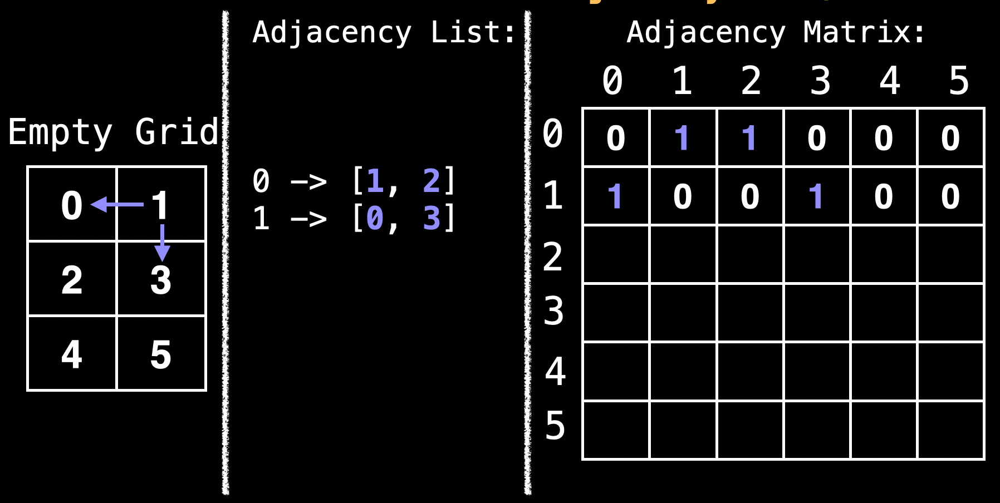

# BFS

The Breadth First Search (BFS) is another fundamental search algorithm used to explore nodes and edges of a graph. It runs with a time complexity of O(V+E) and is often used as a building block in other algorithms

The BFS algorithm is particularly useful for one thing: finding the shortest path on unweighted graphs.

### Using a Queue

The BFS algorithm uses a queue data structure to track which node to visit next. Upon reaching a new node the algorithm adds it to the queue to visit it later.

```
// Global/class scope variables
n = number of nodes in the graph
g = adjacency list representing unweighted graph

// s = start node, e = end node, and 0 < e,s < n
function bfs(s,e):
    // Do a bfs starting at node s
    prev = solve(s)

    // Return reconstructed path from s->e
    return reconstructPath(s, e, prev)

function solve(s):
    q = queue data structure
    q.enqueue(s)

    visited = [false, ..., false] // size n
    visited[s] = true;

    prev = [null, ..., null] // size n
    while !q.isEmpty():
        node = q.deque()
        neightbors = g[node];

        for(next: neighbors):
            if !visited[next]:
                q.enqueue(next)
                visited[next] = true
                prev[next] = node
    return prev

function reconstructPath(s, e, prev):
    // reconstruct path going backwards from e
    path = []
    for(at = e; at !== null; at = prev[at]):
        path.add(at)

    path.reverse()

    // if s and e are connected return the path
    if path[0] === s:
        return path;

    return []
```

### BFS Shortest Path on a Grid

Many problems in graph theory can be represented using a grid. Grids are a form of implicit graph because we can determine a node’s neighbours based on our location within the grid.

A type of problem that involves finding a path through a grid is solving a maze:

Another example could be routing through obstacles (trees, rivers) to get to a location.

A common approach to solving graph theory problems on grids is to first convert the grid to a familiar format such as an adjacency list/matrix.

How do we do that?

First, label all the cells in the grid with numbers [0, n). Then we want to construct an adjacency matrix/list based off this grid.



Once we have an adjacency list/matrix we can run whatever specialized graph algorithm to solve our problem such as: shortest path, connected components, etc…
However, **transformations between graph representations can usually be avoided** due to the structure of a grid.

Due to the structure of a grid, if we are at the red ball in the middle we know we can move left, right, up and down to reach adjacent cells:


Mathematically, if the red ball is at the row-column coordinate (r, c) we can add the row vectors [-1, 0], [1, 0], [0, 1], and [0, -1] to reach adjacent cells.
If the problem you are trying to solve allows moving diagonally then you can also include the row vectors: [-1, -1], [-1, 1], [1, 1], [1, -1]

### Direction Vectors

This makes it very easy to access neighboring cells from the current row-columb position:

```
// Define the direction vectors for north, south, east, west
dr = [-1, +1, 0, 0];
dc = [0, 0, +1, -1];

for(i = 0; i < 4; i++):
    rr = r + dr[i];
    cc = c + dc[i];
    // skip invalid cells. Assume R and C for the no. of rows and columns
    if rr < 0 or cc < 0: continue
    if rr >= R or cc >= C: continue

    // (rr, cc) is a neighboring cell of (r,c)
```

#### Dungeon Problem Statement

You are trapped in a 2D dungeon and need to find the quickest way out!. The dungeon is composed of unit cubes which may or may not be filled with rock. It takes one minute to move one unit north, south, east, west. You cannot move diagonally and the maze is surrounded by a solid black rock on all sides.
Is an escape possible? If yes, how long will it take?

The dungeon has a size of RXC and you start at cell 'S' and there's an exit at cell 'E'. A cell with rock is indicated by '#' and empty cells by '.'.

You can do a simple BFS to solve this.

```
// Global/class scope variables
R, C = … // R = number of rows, C = number of columns
m = …    // Input character matrix of size R x C
sr, sc = … // ’S’ start row and column values
rq, cq = … // Empty Row Queue (RQ) and Column Queue (CQ)

// Variables used to track the number of steps taken.
move_count = 0
nodes_left_in_layer = 1
nodes_in_next_layer = 0

// Variable used to track whether the ‘E’ character
// ever gets reached during the BFS.
reached_end = false

// R x C matrix of false values used to track whether
// the node at position (i, j) has been visited.
visited = …

// North, south, east, west direction vectors.
dr = [-1, +1,  0,  0]
dc = [ 0,  0, +1, -1]

function solve():
  rq.enqueue(sr)
  cq.enqueue(sc)
  visited[sr][sc] = true
  while rq.size() > 0: // or cq.size() > 0
    r = rq.dequeue()
    c = cq.dequeue()
    if m[r][c] == ‘E’:
      reached_end = true
      break
    explore_neighbours(r, c)
    nodes_left_in_layer—-
    if nodes_left_in_layer == 0:
      nodes_left_in_layer = nodes_in_next_layer
      nodes_in_next_layer = 0
      move_count++
  if reached_end:
    return move_count
  return -1

function explore_neighbours(r, c):
  for(i = 0; i < 4; i++):
    rr = r + dr[i]
    cc = c + dc[i]

    # Skip out of bounds locations
    if rr < 0 or cc < 0: continue
    if rr >= R or cc >= C: continue

    // Skip visited locations or blocked cells
    if visited[rr][cc]: continue
    if m[rr][cc] == ‘#’: continue

    rq.enqueue(rr)
    cq.enqueue(cc)
    visited[rr][cc] = true
    nodes_in_next_layer++
```
