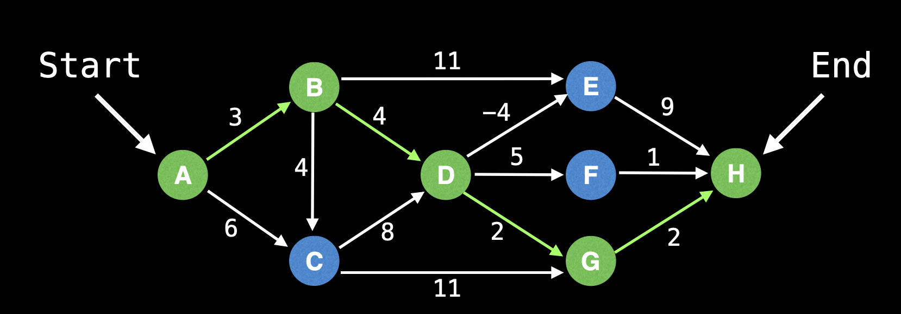
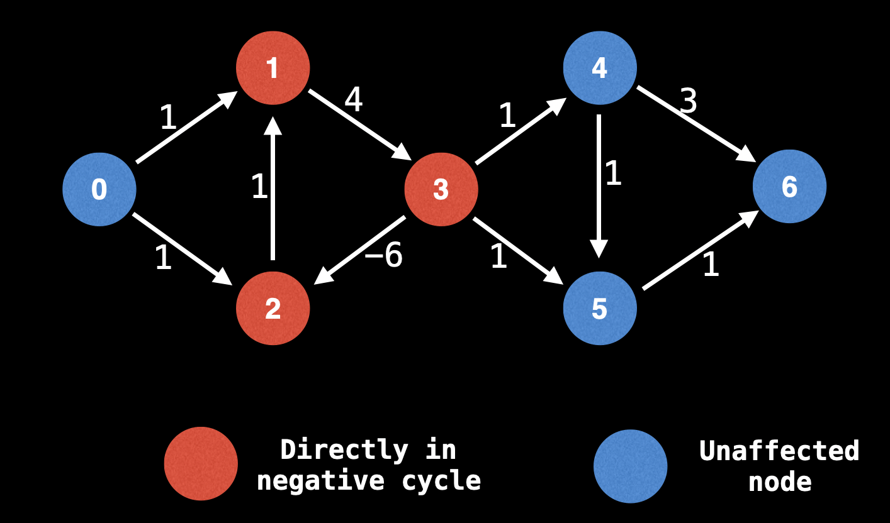
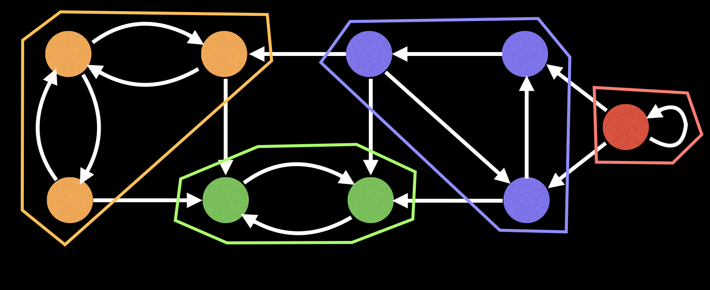
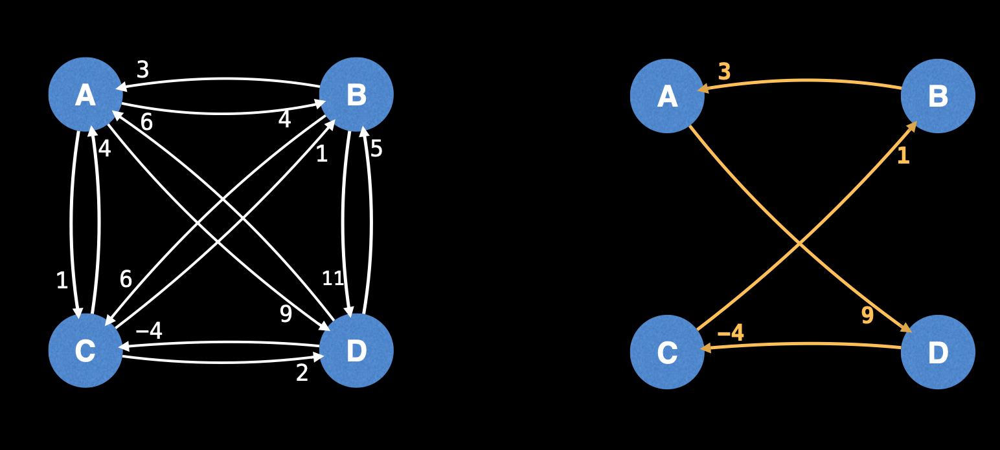
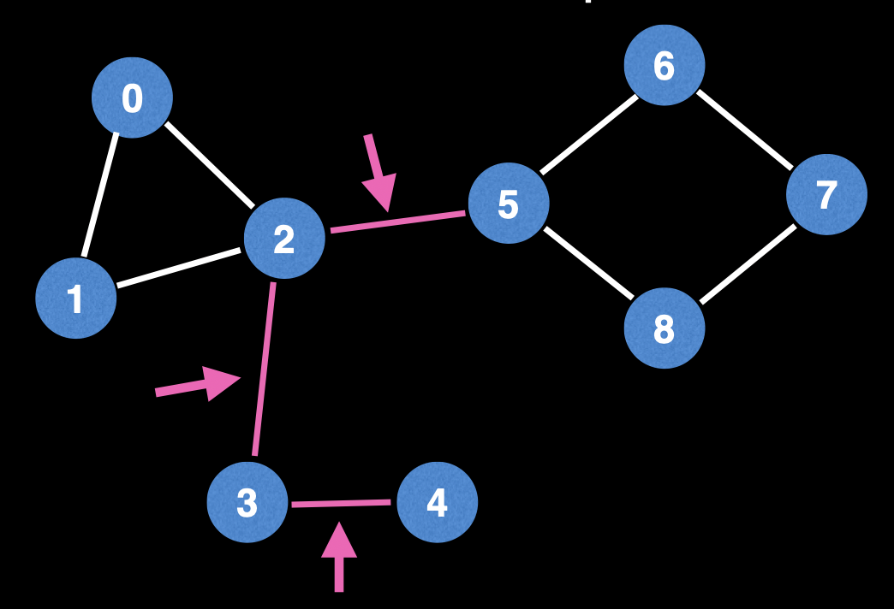
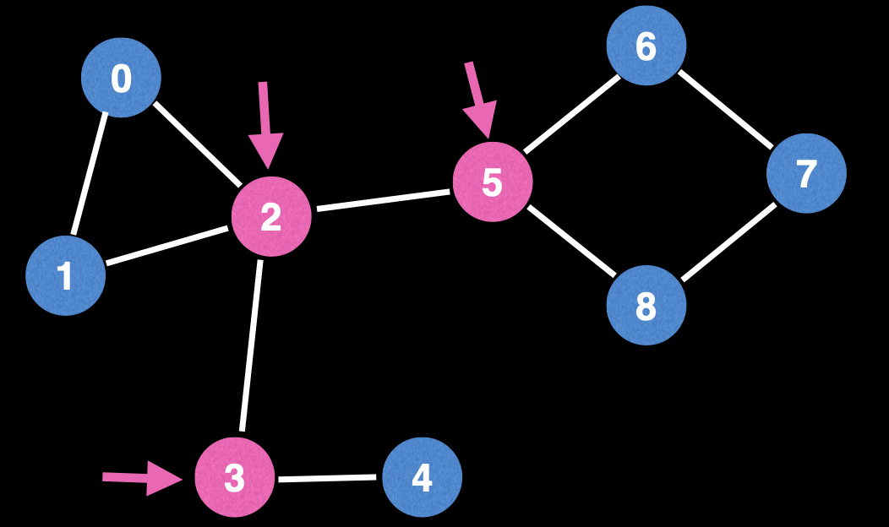

# Graphs

## Common Graph Problems

1. **Shortest Path Problem**
   Given a weighted graph, find the shortest path of edges from node A to B

   **Algorithms**: BFS (unweighted graph), Dijkstras algorithm, Bellman-Ford, Floyd-Warshall, A\*

   

2. **Connectivity**
   Does there exist a path between Node A and Node B?
   Typical Solution: Use union find data structure or any search algorithm (DFS)

3. **Negative Cycles**
   Does my weighted graph have any negative cycles? If so where?
   You can keep cycling it and the cost gets shorter. If you're finding the shortest path, it's a trap.
   There are real contexts where this is beneficial. e.g. Arbitrage in currencies
   **Algorithms**: Bellman-Ford and Floyd-Warshall

   

4. **Strongly Connected Components**
   Strongly Connected Components (SCCs) can be thought of as self-contained cycles within a directed graph where every vertex in a given cycle can reach every other vertex in the same cycle
   **Algorithms**: Tarjan's and Kosaraju's algorithms
   

5. **Traveling Salesman Problem**
   "Given a list of cities and distances between each pair of cities, what is the shortest possible route that visits each city exactly once and returns to the origin city?"
   It is a NP-hard problem i.e. computationally challenging
   **Algorithms**: Held-Karp, branch and bound and many approximation algorithms
   

6. **Bridges**
   A **bridge** / **cut edge** is any edge in a graph whose removal increases the number of connected components
   Bridges are important in graph theory because they often hint at weak points, bottlenecks or vulnerabilities in the graph
   

7. **Articulation Points**
   An **articulation point** / **cut vertex** is any node in a graph whose removal increases the number of connected components
   

8. **Minimum Spanning tree**
   A **Minimum Spanning Tree** is a subset of the edges of a connected, edge-weighted graph that connects all vertices together, without any cycles and with the minimum possible total edge-weight.
   i.e. a tree using the edges which covers all nodes of the graph at a minimal cost
   Applications - designing a least cost network, circuit design, transportation networks
   **Algorithms**: Kruskal's, Prim's & Boruvka's

9. **Network Flow: max flow**
   Q: With an infinite input source how much "flow" can we push through the network?
   Flow networks are graphs where edge denotes capacities in some sense.
   At some point there is bound to be a bottleneck somewhere in the graph which limits the amount of stuff traveling on the network.
   **Algorithms:** Ford-Fulkerson, Edmonds-Karp
